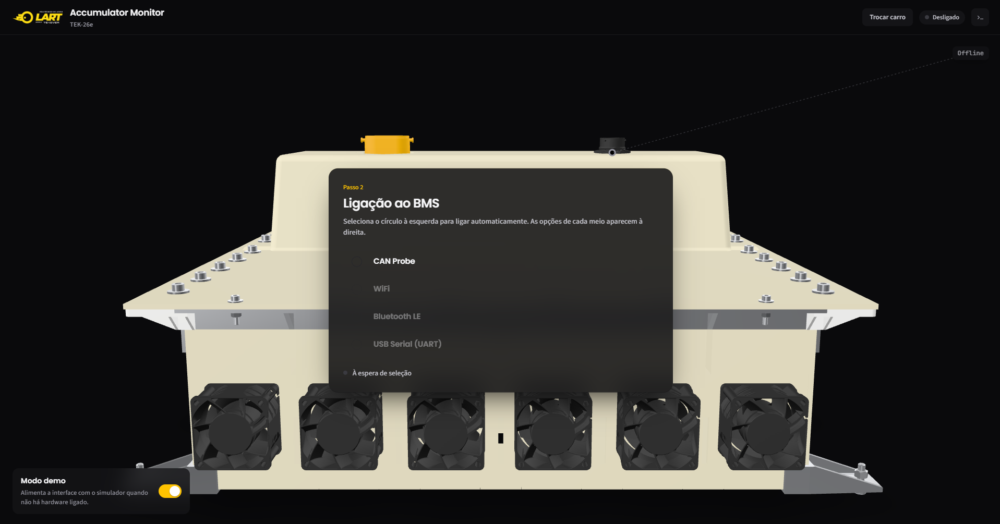

# BMS_UI

Interface de monitorização do acumulador.



## Run

```bash
pip install -r requirements.txt
```

App:

```bash
python app.py
```

Apenas o servido:

```bash
python app.py --web --port 8123
```

Sem hardware ligado: deixa o **Modo demo** ligado no ecrã de connect.

## Tree

```
app.py                 launch: uvicorn + pywebview
compile.py             gera o exe (PyInstaller) - tudo o que sai vai pra compile/
backend/
  cars/                escolha carro
    models.py          3d (CarProfile, Hotspot, CameraView...)
    common.py          o que os 3 carros partilham: barramentos, comandos
    tek26e.py          um ficheiro por carro, muda DBC e modelos 3d
  state.py             modelo que a UI consome
  simulator.py         self explanatory
  manager.py           liga/desliga transporte, corre o loop, faz broadcast
  main.py              FastAPI: /api/scan, /api/connect, /ws
  logbuffer.py         logs para a consola in-app
  dbcstore.py          vai buscar as DBCs: local, cache, incluida, download
  elfsyms.py           tabela de simbolos do .elf do firmware (onde esta o live_debug)
  dbc/                 DBCs commitadas - pra funcionar sem net
  decode/
    t26.py             DBC
    live_json.py       dump JSON do firmware (BLE) -> BmsState
    live_struct.py     struct live_debug lida da RAM (WiFi) -> BmsState
  transports/
    base.py            interface Transport: stream de RawFrame
    discovery.py       scan de portas série, interfaces CAN, BLE, redes WiFi
    can_bus.py         python-can: thread de leitura + drain por tick
    ble.py             RN4871: linhas JSON por notificacao
    gdbrsp.py          cliente do protocolo do GDB (TCP)
    wifi.py            Black Magic no ESP32: le a RAM do STM32 por SWD
    DBC_T26.md         mapa do barramento e bugs conhecidos da DBC
frontend/
  index.html           três screens: carro, conn e dashboard
  css/app.css          design + layout
  js/cars.js           seleção do carro
  js/connect.js        connection methods
  js/viewer.js         wrapper do <model-viewer>
  js/dashboard.js      info lol
  js/bms-settings.js   TODOS os valores default e textos da config
  js/config.js         pagina de configuracao do bms (bloqueia em HV_ON)
  js/curves.js         graficos das curvas da config
  js/panels.js         graficos de barras e tabelas
  js/preload.js        carrega os GLBs todos antes de arrancar
  js/console.js        consola in-app
  js/theme.js          modo escuro/claro, arranca pelas definicoes do sistema
  js/api.js            fetch + websocket
  js/chart.js          sparkline sem dependências - merdas feitas pelo claudio, fazer melhor tho
  pics/                pics bitch
  models/              GLBs - 3d models
  fonts/               fonts
  js/vendor/           model-viewer guardado no repo - pra funcionar sem net
```

## Ligações

| Meio | O que chega | Como |
|---|---|---|
| CAN | tramas do barramento | python-can + DBC |
| Bluetooth LE | uma linha JSON por segundo | RN4871 em UART transparente |
| WiFi | a struct `live_debug` lida da RAM | servidor GDB do Black Magic num ESP32 |

O caminho WiFi precisa do `.elf` que está gravado no AMS: o servidor GDB só
fala em endereços, e é o `.elf` que diz onde vive o `live_debug`. Escolhe-se no
próprio ecrã de ligação. Ler assim obriga a agarrar o alvo uma vez, o que **para
o CPU do AMS por instantes** — os detalhes e o porquê estão no cabeçalho de
`backend/transports/wifi.py`.
